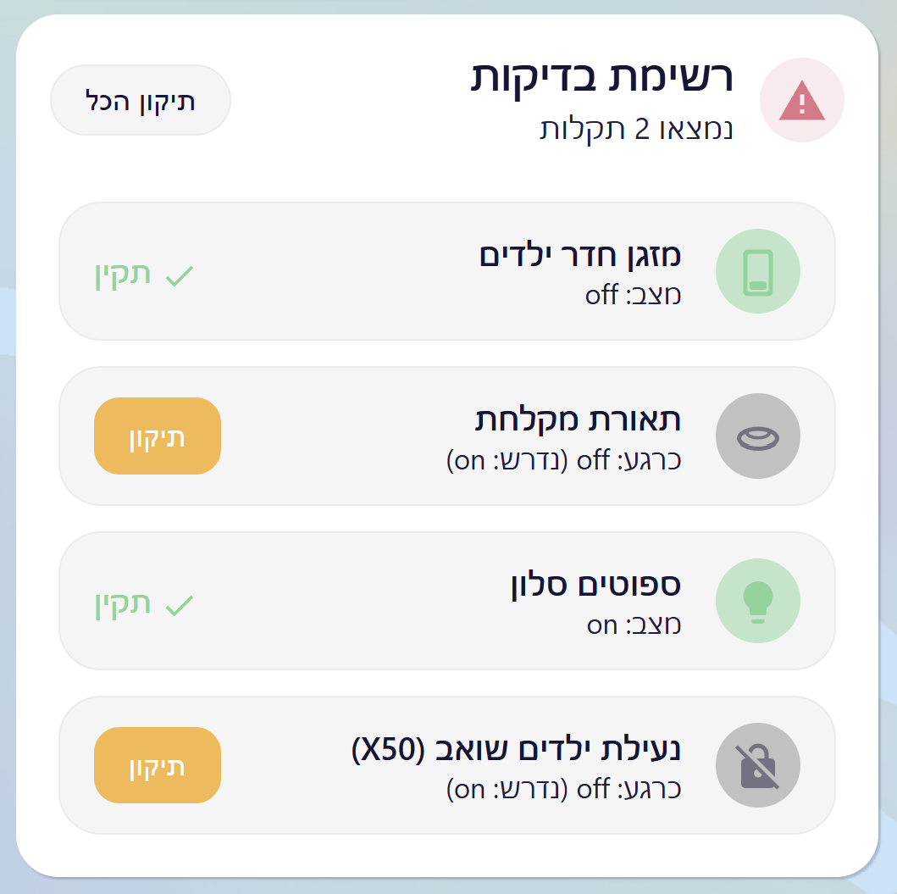

# Checklist Card for Home Assistant

[](https://github.com/custom-components/hacs)
[](https://github.com/yosef-chai/ha-checklist-card/releases)
[](LICENSE)

[](https://my.home-assistant.io/redirect/hacs_repository/?owner=yosef-chai&repository=ha-checklist-card&category=lovelace)

A Lovelace custom card that monitors a list of entity states against expected values and surfaces any problems — with a single **Fix** or **Fix All** button to call the correct Home Assistant service automatically.



---

## Features

- **At-a-glance status** — green header when everything is OK, red when problems exist
- **Auto-fix** — infers the correct HA service for lights, switches, locks, covers, climate, selects, numbers, vacuums, and more
- **Custom fix services** — override the auto-fix with any service call and arbitrary service data
- **Multi-condition checks** — combine conditions with AND / OR logic per entity
- **Prerequisite guards** — skip a check automatically when a prerequisite entity is not in the expected state
- **Attribute checks** — evaluate any entity attribute instead of (or in addition to) its state
- **Flexible layout** — vertical columns or horizontal rows, configurable count
- **Hide OK items** — keep the card compact by showing only entities with problems
- **RTL support** — full right-to-left rendering for Hebrew and other RTL languages
- **Localized UI** — English and Hebrew built-in; easy to extend

---

## Installation

### HACS (recommended)

1. Open HACS in your Home Assistant instance.
2. Go to **Frontend** → click the menu (⋯) → **Custom repositories**.
3. Add `https://github.com/yosef-chai/ha-checklist-card` with category **Lovelace**.
4. Search for **Checklist Card** and click **Download**.
5. Reload your browser.

Or click the button above to open the repository directly in HACS.

### Manual

1. Download `checklist-card.js` from the [latest release](https://github.com/yosef-chai/ha-checklist-card/releases/latest).
2. Copy it to `config/www/checklist-card.js`.
3. Add the resource to your dashboard:

   **Via UI:** Settings → Dashboards → ⋯ → Resources → Add resource
   ```
   URL:  /local/checklist-card.js
   Type: JavaScript module
   ```

   **Via YAML:**
   ```yaml
   lovelace:
     resources:
       - url: /local/checklist-card.js?v=1.0.0
         type: module
   ```

---

## Configuration

### Minimal example

```yaml
type: custom:checklist-card
checks:
  - entity: switch.outdoor_lights
    conditions:
      - state: "off"
  - entity: lock.front_door
    conditions:
      - state: locked
```

### Full example

```yaml
type: custom:checklist-card
title: Evening Checklist
show_ok_items: false
layout:
  mode: columns
  count: 2
checks:
  - entity: switch.outdoor_lights
    name: Outdoor Lights
    conditions_mode: any
    default_condition_index: 0
    conditions:
      - state: "off"

  - entity: climate.living_room
    name: Living Room AC
    conditions:
      - state: "off"

  - entity: cover.garage
    name: Garage Door
    conditions:
      - state: closed

  - entity: light.bedroom
    name: Bedroom Light
    conditions_mode: any
    default_condition_index: 0
    conditions:
      - state: "off"
      - state: "on"
        attribute: brightness
        attribute_value: "20"

  - entity: input_boolean.night_mode
    name: Night Mode (only at night)
    conditions:
      - state: "on"
        prerequisite_entity: sun.sun
        prerequisite_state: below_horizon
```

---

### Card options

| Option | Type | Default | Description |
|---|---|---|---|
| `type` | string | **required** | `custom:checklist-card` |
| `title` | string | `"Checklist"` | Heading shown at the top of the card |
| `checks` | list | **required** | Ordered list of [check rules](#check-rule-options) |
| `show_ok_items` | boolean | `true` | Show entities that are already in the OK state |
| `layout` | object | — | [Layout configuration](#layout-options) |

### Check rule options

| Option | Type | Default | Description |
|---|---|---|---|
| `entity` | string | **required** | `entity_id` of the entity to monitor |
| `name` | string | friendly name | Display name shown on the card row |
| `conditions` | list | **required** | One or more [state conditions](#condition-options) that define "OK" |
| `conditions_mode` | `any` \| `all` | `any` | `any` — at least one condition passes (OR); `all` — every condition must pass (AND) |
| `default_condition_index` | number | `0` | In `any` mode: index of the condition whose fix action is used when **Fix** is pressed |

### Condition options

| Option | Type | Default | Description |
|---|---|---|---|
| `state` | string | **required** | Expected entity state (e.g. `"off"`, `"locked"`, `"heat"`) |
| `attribute` | string | — | Attribute name to check instead of the entity state |
| `attribute_value` | string | same as `state` | Expected attribute value (when `attribute` is set) |
| `fix_service` | string | auto | Custom fix service. Accepts `"domain.service"` or a JSON string: `'{"service":"light.turn_on","data":{"brightness":255}}'` |
| `prerequisite_entity` | string | — | Skip this condition unless the prerequisite entity meets its required state |
| `prerequisite_state` | string | `"on"` | Required state of `prerequisite_entity`. Comma-separated for OR; prefix `!=` for negation (e.g. `"!=off"`) |
| `prerequisite_attribute` | string | — | Attribute of `prerequisite_entity` to evaluate instead of its state |
| `prerequisite_attribute_value` | string | — | Required value for `prerequisite_attribute` |

### Layout options

| Option | Type | Default | Description |
|---|---|---|---|
| `mode` | `columns` \| `rows` | `columns` | `columns` — vertical scrolling grid; `rows` — horizontal scrolling grid |
| `count` | number | `1` | Number of columns (in `columns` mode) or rows (in `rows` mode). Range: 1–10 |

---

## Supported domains (auto-fix)

When no `fix_service` is specified, the card picks the correct service automatically:

| Domain | Fix service |
|---|---|
| `light`, `switch`, `input_boolean`, `fan` | `turn_on` / `turn_off` |
| `lock` | `lock` / `unlock` |
| `cover` | `open_cover` / `close_cover` |
| `climate` | `set_hvac_mode` |
| `select`, `input_select` | `select_option` |
| `number`, `input_number` | `set_value` |
| `vacuum` | `start` / `return_to_base` |
| everything else | `turn_on` / `turn_off` |

---

## Translations

The card ships with **English** and **Hebrew** built in. The active language is detected automatically from the Home Assistant UI language setting.

### Adding a new language

1. Open `src/localize.ts`.
2. Copy the `en` block and add a new top-level key using the [BCP 47 primary language subtag](https://www.iana.org/assignments/language-subtag-registry) (e.g. `"de"` for German, `"fr"` for French).
3. Translate every string value.
4. Run `npm run build` and submit a pull request.

```ts
// src/localize.ts — example adding German
const TRANSLATIONS = {
  en: { ... },
  he: { ... },
  de: {
    card_name: 'Checklisten-Karte',
    all_good: 'Alles in Ordnung!',
    // ... all other keys
  },
};
```

### Currently supported languages

| Code | Language |
|---|---|
| `en` | English |
| `he` | Hebrew (עברית) — RTL |

---

## Development

```bash
# Install dependencies
npm install

# Build (type-check + bundle)
npm run build

# Output: dist/checklist-card.js
```

The project uses **Lit 3** web components and **Vite** in library mode. TypeScript strict mode is enabled.

```
src/
  index.ts                    # Entry point + window.customCards registration
  types.ts                    # TypeScript interfaces and constants
  localize.ts                 # i18n module
  utils.ts                    # Pure utility functions
  checklist-card.ts           # Main card component
  checklist-card.styles.ts    # Card CSS
  checklist-card-editor.ts    # Visual editor component
  checklist-card-editor.styles.ts
```

---

## License

MIT — see [LICENSE](LICENSE).
